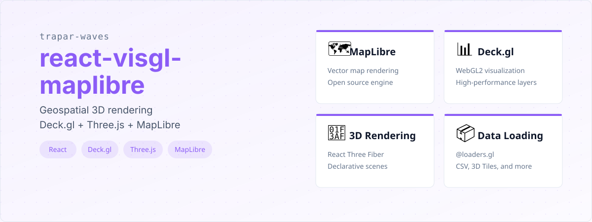
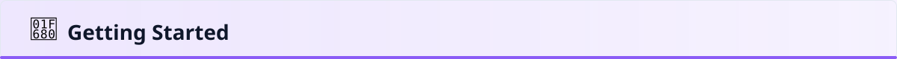
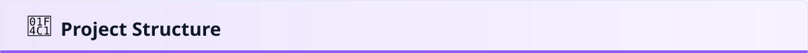
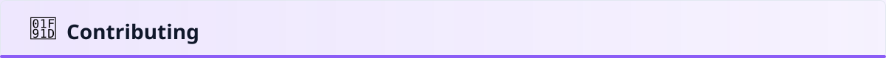
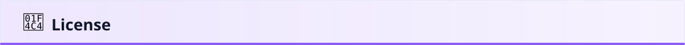

# @trapar-waves/react-visgl-maplibre


---

[中文](./readme/README-CN.md) | [日本語](./readme/README-JP.md) | [Русский язык](./readme/README-RU.md)

> A React-based geospatial visualization template integrating Three.js, Deck.gl, and MapLibre for 3D map interactions and rich geospatial data rendering.




- **Integrated Geospatial Stack:** Combines MapLibre GL JS for vector maps, Deck.gl for high-performance WebGL-based visualization layers, and Three.js for custom 3D objects, all within a React environment.
- **React Three Fiber & react-three-map:** Uses `@react-three/fiber` for declarative Three.js scenes and `react-three-map` to synchronize Three.js objects with MapLibre map movements and terrain.
- **Deck.gl Layers & Effects:** Supports a wide range of Deck.gl layers (e.g., HexagonLayer for aggregations) and effects (e.g., lighting) for advanced data visualization.
- **Data Loading:** Incorporates `@loaders.gl` for efficient loading and parsing of various data formats like CSV and 3D Tiles.
- **Modern Development Experience:**
  - Built with Rsbuild for fast HMR and optimized builds.
  - Styled with Tailwind CSS for rapid UI development.
  - Fully typed with TypeScript for improved code quality and developer experience.
  - Linting and formatting with ESLint.
  - Git hooks with Husky for code quality checks.


- **UI Framework:** `React` (v19) — Core for component-based development.
- **Map Engine:** `MapLibre GL JS` — Open-source vector map rendering.
- **Visualization:** `Deck.gl` — High-performance WebGL2 data visualization layers.
- **3D Rendering:** `Three.js` & `React Three Fiber` — Declarative 3D scene graph.
- **Map-3D Bridge:** `react-three-map` — Synchronizes Three.js objects with map camera.
- **Data Loading:** `@loaders.gl` — Modular framework for parsing CSV, 3D Tiles, and more.
- **Build Tool:** `Rsbuild` — Fast build tool based on Rspack.
- **Styling:** `Tailwind CSS` — Utility-first CSS framework.
- **Language:** `TypeScript` — Static type checking.

See the [package.json](./package.json) for a full list of dependencies.



### Prerequisites

- Node.js (>= 18.x recommended)
- Package manager (npm, yarn, or pnpm)

### Installation

1. Create a new project using the template:

   ```bash
   pnpm create trapar-waves
   ```

2. Navigate to your project directory and install dependencies:

   ```bash
   pnpm install
   ```

3. Start the development server:

   ```bash
   pnpm dev
   ```



```
├── public/             # Static assets
├── src/                # Source code
│   ├── App.tsx         # Main application component
│   ├── index.tsx       # Entry point for React app
│   ├── deckgl/         # Deck.gl layer and overlay configuration
│   ├── source/         # MapLibre map source components
│   └── global.css      # Global styles (Tailwind imports)
├── rsbuild.config.ts   # Rsbuild configuration
├── tsconfig.json       # TypeScript configuration
├── eslint.config.js    # ESLint configuration
└── package.json        # Project dependencies and scripts
```



Contributions are welcome and greatly appreciated! Please follow these steps to contribute:

1. Fork the repository
2. Create your feature branch (`git checkout -b feature/amazing-feature`)
3. Commit your changes (`git commit -m 'Add some amazing feature'`)
4. Push to the branch (`git push origin feature/amazing-feature`)
5. Open a Pull Request



MIT License © 2025 Trapar Waves

## 👤 Author

- **Rikka:** [admin@rikka.cc](mailto:admin@rikka.cc)
- **GitHub Profile:** [Muromi-Rikka](https://github.com/Muromi-Rikka)

## 🔗 Links

- **Repository:** [https://github.com/Trapar-waves/react-visgl-maplibre](https://github.com/Trapar-waves/react-visgl-maplibre)
- **Issues:** [https://github.com/Trapar-waves/react-visgl-maplibre/issues](https://github.com/Trapar-waves/react-visgl-maplibre/issues)
